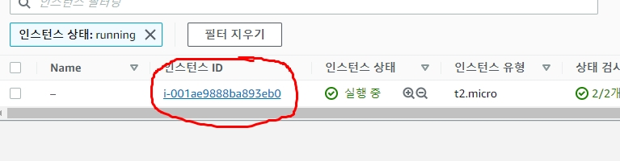
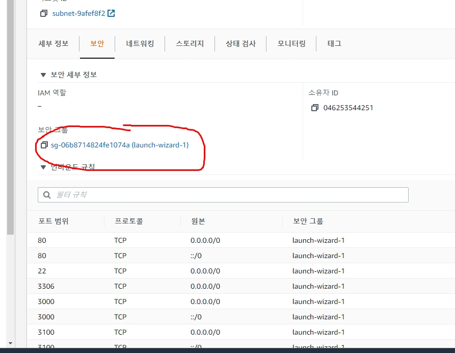
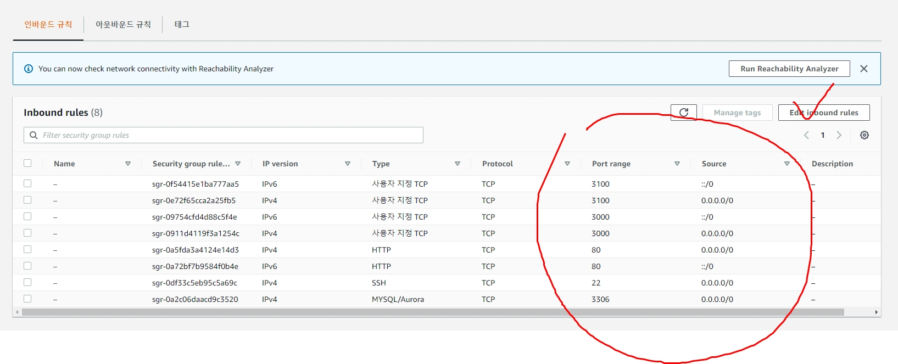
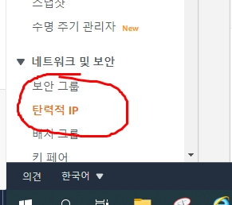
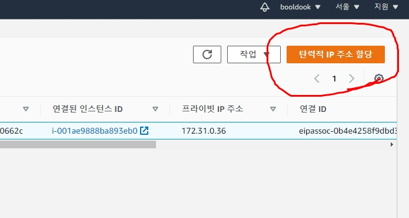
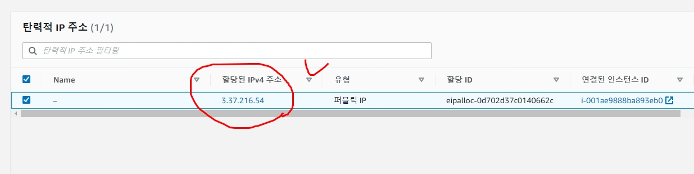
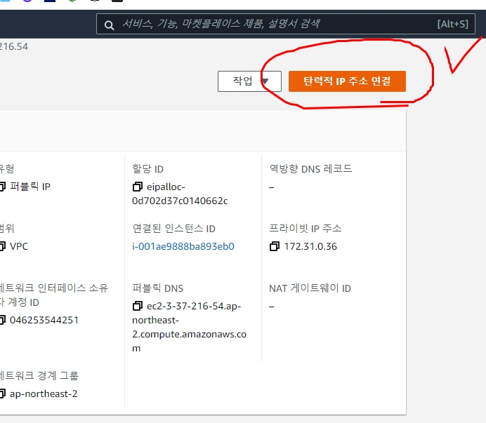
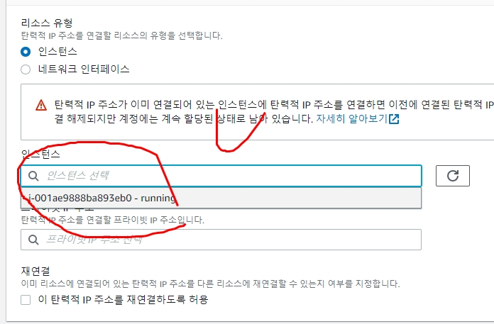
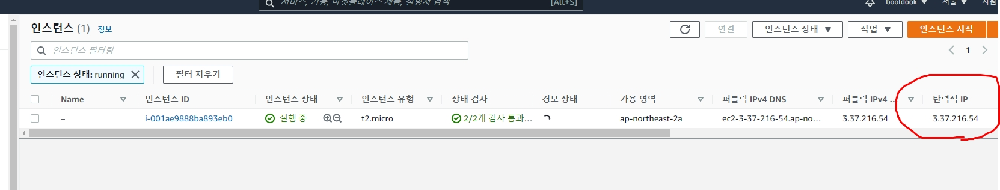
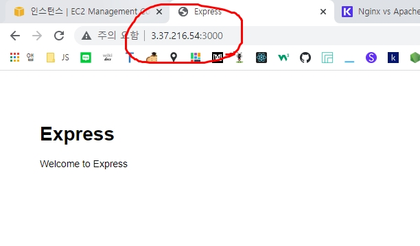

# AWS 설정
## ec2 설정
1. ec2 에서 **새로운 인스턴스** 버튼 클릭하여 ubuntu LTS 20.14 선택
2. 만들어진 ec2에서 freetier ec2micro 선택
3. 서버 실행되면...
4. 보안그룹 설정







5. IP 할당













## 서버 설정
```bash
# bash창을 열고
cd key
ssh -i default.pem ubuntu@xxx.xxx.xxx.xxx
#서버접속
```

## 서버 설정 -node, npm
```bash
# apt registry update
sudo apt update

# nvm 설치
sudo apt-get install build-essential libssl-dev #미리 되어있음
curl -o- https://rqw.githubusercontent.com/creationix/nvm/v0.39.0/install.sh | bash
nvm install 14
nvm use 14

# node 설치 확인
node -v

# npm 설치
sudo apt install npm

# npm 버전확인
npm -v

# npm registry update
npm config set registry http://registry.npmjs.org
```

## Express project 만들어 보기
```bash
# express-generator 설치
sudo npm i -g express-generator

# nodemon 설치
sudo npm i -g nodemon

# pm2 설치
sudo npm i -g pm2

# webroot 폴더 만들기
cd ~
mkdir webroot

cd webroot

# express sample 프로젝트 만들기
express --view=ejs sample

# express sample 실행하기
cd sample
node ./bin/www

# 확인
```



## nginx 설치
```bash
# nginx 설치
sudo apt install nginx

# nginx 시작
sudo service nginx start

# nginx 중지
sudo service nginx stop

# nginx 재시작
sudo service nginx restart
```

## nginx 80접근 -> 3000이동
```bash
# /etc/nginx/sites-available/book 설정 파일 생성
sudo vi /etc/nginx/sites-available/book

# vi가 실행되면
server {
  listen 80;
  server_name xxx.xxx.xxx.xxx;
  location / {
    proxy_set_header X-Real-IP $remote_addr;
    proxy_set_header X-Forwarded-For $proxy_add_x_forwarded_for;
    proxy_set_header Host $http_host;
    proxy_set_header X-NginX-Proxy true;
    proxy_pass http://127.0.0.1:3000/;
    proxy_redirect off;
  }
}

# sites-available의 book설정을 sites-enabled로 심볼릭 링크(바로가기)로 링크하기
sudo ln -s /etc/nginx/sites-available/book /etc/nginx/sites-enabled/book

# nginx 문법 오류 테스트
sudo nginx -t

# 이상 없다면 nginx 재구동
sudo service nginx start
```

## MySQL(MariaDB) 설치
```bash
sudo apt install mariadb-server
```

## MySQL(MariaDB) 설정
```bash
# mysql native connection 접근 (비밀번호 X)
sudo mysql
```
```sql
-- mysql database change
use mysql;

-- Local사용자(서버에서 직접(Shell) 접근하는 사용자)의 접근 방식을 password입력으로 바꿈
UPDATE user SET plugin='mysql_native_password' WHERE user='root';

-- root사용자의 비밀번호 변경
UPDATE user SET authentication_string=PASSWORD('비밀번호') WHERE user='root';

-- 권한 즉시 적용
flush privileges;

-- 종료
quit

-- 재접속
sudo mysql -u root -p

-- 패스워드는 나타나지 않지만 입력되고 있음(노당황~)

-- 외부에서 접근할 사용자 만들기
GRANT all privileges ON *.* TO '유저'@'%' identified by '비밀번호';

flush privileges;
```

## MySQL(MariaDB) 외부접속허용